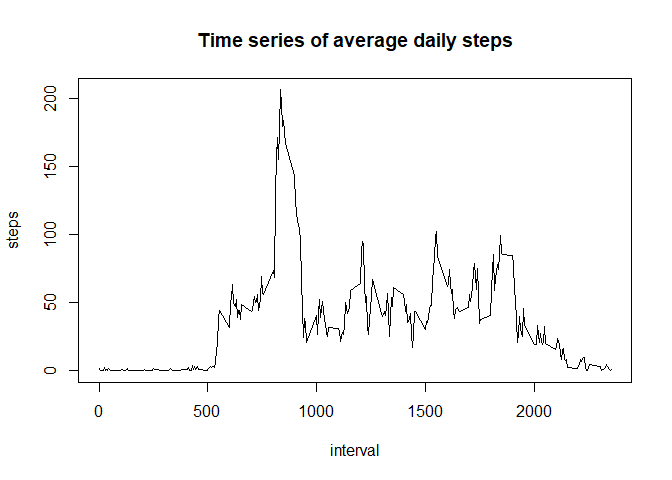
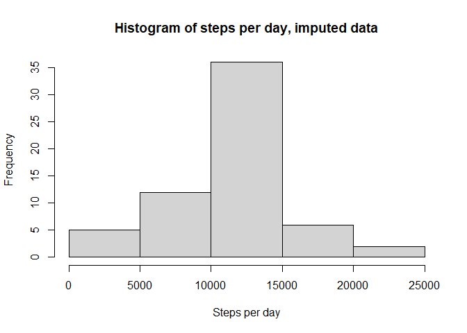
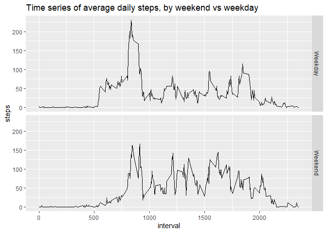

For this assignment, we will first load and process the data. Also, we load r packages dplyr and ggplot2 to use later. 


```r
## Loading and preprocessing the data
setwd("C:/Users/Sarah Lynn/Desktop/Self Study/Coursera DS JH - reproducible research/Week 2 project")
unzip(zipfile="activity.zip")
data0 <- read.csv("activity.csv")
data0$date <- as.Date(data0$date,c("%Y-%m-%d"))
```

```r
library(dplyr)
library(ggplot2)
```


   


Next we are interested in the mean total number of steps taken per day. 


```r
## What is mean total number of steps taken per day?
data1 <- data0[complete.cases(data0),]
steps_per_day <- aggregate(steps ~ date, data1, sum)
hist(steps_per_day$steps,xlab="Steps per day",main="Histogram of steps per day")
```

<!-- -->

```r
mean_steps <- round(mean(steps_per_day$steps),2)
med_steps <- median(steps_per_day$steps)
```
Here we have a histogram of this data. From this, the mean steps per day is 10766.19 and the median steps per day is 10765.


   


Next we look at the average daily activity pattern.

```r
## What is the average daily activity pattern?
steps_per_int <- aggregate(steps ~ interval, data1, mean)
plot(steps_per_int$interval,steps_per_int$steps,type="l",ylab="steps",xlab="interval",main="Time series of average daily steps")
```

<!-- -->

```r
max_int <- steps_per_int[max(steps_per_int$steps)==steps_per_int$steps,1]
```

From the plot, it looks like the higher activity happens in the morning (early intervals). The interval that contains the maximum number of steps is 835.


   


Next we will impute the missing values, and view a histogram of the total number of steps taken each day with the imputed data. The strategy we will use to impute the missing values is to use the mean for that 5-minute interval. 


```r
## Imputing missing values
num_missing_values <- dim(data0)[1] - sum(complete.cases(data0))
#strategy for filling in missing values will be to use the mean for interval
steps_per_int1 <- rename(steps_per_int,"steps_avg" ="steps")
data2 <- merge(data0,steps_per_int1,by=intersect(names(data0),names(steps_per_int1)))
data3 <- mutate(data2, steps=ifelse(is.na(steps), steps_avg, steps))
data_imputed <- data3[,c("interval","date","steps")]
steps_per_day2<- aggregate(steps ~ date, data_imputed, sum)
hist(steps_per_day2$steps,xlab="Steps per day",main="Histogram of steps per day, imputed data")
```

<!-- -->

```r
impute_mean_steps <- round(mean(steps_per_day2$steps),2)
impute_med_steps <- round(median(steps_per_day2$steps),2)
```

From the code above, the total number of missing values in the dataset is 2304. 

Viewing the histogram, you can see that imputing the missing data creates a higher frequency count in the center of the histogram, and moves the median (now 10766.19) equal to the mean (now 10766.19). Notice that the mean remains unchanged compared to the pre-imputed data.


   
Lastly, we will look at any differences there might be in activity patterns between weekdays and weekends.


```r
## Are there differences in activity patterns between weekdays and weekends?
data4 <- mutate(data_imputed, week_ind=as.factor(ifelse(weekdays(data_imputed$date) %in% c("Saturday","Sunday"),"Weekend","Weekday")))
steps_per_day3<- aggregate(steps ~ week_ind + interval, data4, mean)
ggplot(data=steps_per_day3,mapping=(aes(x=interval,y=steps)))+geom_line()+facet_grid(rows=vars(week_ind))+ggtitle("Time series of average daily steps, by weekend vs weekday")
```

<!-- -->

From this, it looks like weekdays have higher average steps in the morning (early intervals) as compared to weekend days, where the activity is better spread throughout the day.

The end
